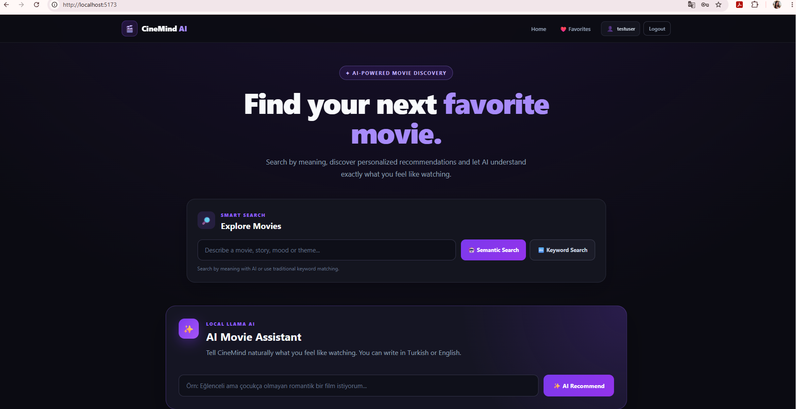
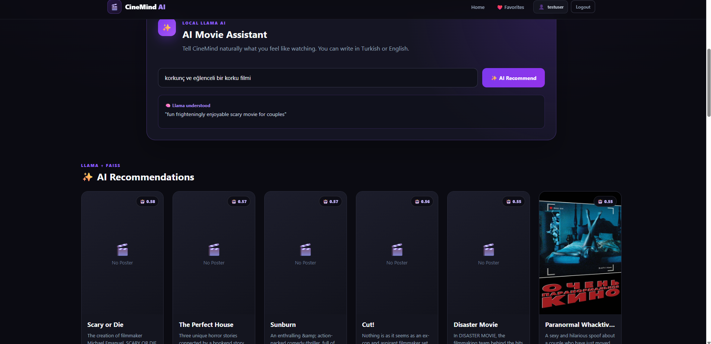
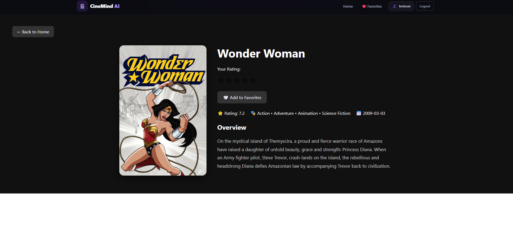
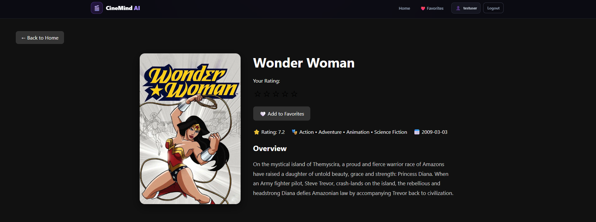
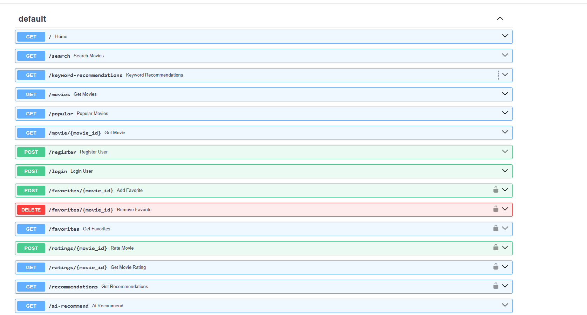

# 🎬 CineMind AI

**AI-Powered Personalized Movie Recommendation System**

CineMind AI is a full-stack movie discovery and recommendation platform that combines traditional recommendation algorithms, NLP, semantic search, vector retrieval, personalized hybrid ranking, and a local Large Language Model (LLM).

Users can search for movies by meaning, rate and save movies, receive personalized recommendations, or simply describe what they want to watch in natural language.

---

## ✨ Features

### 🤖 AI Movie Assistant
Users can describe the type of movie they want to watch using natural language.

Example:

```text
Sevgilimle izleyebileceğim eğlenceli ama çocukça olmayan romantik bir film istiyorum.
```

CineMind processes the request through:

```text
Natural Language Request
        ↓
Local Llama 3.2 (Ollama)
        ↓
English Semantic Query
        ↓
Sentence Transformer
        ↓
Vector Embedding
        ↓
FAISS Vector Search
        ↓
Movie Recommendations
```

The LLM is used to understand and rewrite the request, while movie retrieval remains grounded in the CineMind movie dataset.

---

### 🔎 Semantic Movie Search

CineMind uses the `all-MiniLM-L6-v2` Sentence Transformer model to represent movie descriptions and user queries as semantic embeddings.

This allows users to search by meaning rather than only exact keywords.

Example:

```text
mysterious science fiction movie set in space
```

The query is converted into an embedding and compared against movie vectors using FAISS.

---

### 🔤 Keyword-Based Recommendation

A traditional NLP recommendation pipeline is also available using:

- Text cleaning
- Stopword removal
- Lemmatization
- TF-IDF vectorization
- Cosine similarity

This provides a useful comparison between classical NLP and modern semantic search.

---

### 🎯 Personalized Hybrid Recommendation

Logged-in users can rate movies from **1 to 5 stars**.

Movies rated 4 or 5 stars are used to generate personalized recommendations.

The hybrid recommendation engine combines:

```text
40%  TF-IDF Content Similarity
30%  Semantic Similarity
20%  TMDB Rating
10%  Popularity
```

Candidate movies are generated using both TF-IDF and FAISS semantic retrieval before being ranked by the hybrid scoring system.

---

### ⚡ FAISS Vector Search

CineMind uses FAISS for efficient nearest-neighbor search over movie embeddings.

The current semantic index contains approximately **44,500 movie vectors**, generated using Sentence Transformers.

FAISS `IndexFlatIP` is used with normalized embeddings for similarity retrieval.

---

### ❤️ Favorites

Authenticated users can:

- Add movies to favorites
- Remove movies from favorites
- View their personal favorites page

Favorites are stored per user in the database.

---

### ⭐ Movie Ratings

Users can rate movies from **1–5 stars**.

Ratings are stored in the database and are also used by the personalized recommendation engine.

---

### 🔐 Authentication

CineMind includes:

- User registration
- User login
- Password hashing with bcrypt
- JWT authentication
- Protected API endpoints
- User-specific favorites
- User-specific ratings

---

### 🔥 Popular Movies

The Home page also displays popular movies using TMDB metadata such as popularity, vote count, and rating information.

---

## 🧠 AI Architecture

```text
                         ┌─────────────────┐
                         │  React Frontend │
                         └────────┬────────┘
                                  │
                                  │ Axios / HTTP
                                  ▼
                         ┌─────────────────┐
                         │     FastAPI     │
                         └────────┬────────┘
                                  │
              ┌───────────────────┼───────────────────┐
              │                   │                   │
              ▼                   ▼                   ▼
         TF-IDF NLP       Sentence Transformer    Llama 3.2
              │                   │                (Ollama)
              │                   ▼                   │
              │             Movie Embeddings          │
              │                   │                   │
              │                   ▼                   │
              │                 FAISS ◄───────────────┘
              │                   │
              └───────────┬───────┘
                          ▼
                 Hybrid Recommendation
                          │
                          ▼
                   Movie Results
```

---

## 🛠️ Tech Stack

### Backend

- Python
- FastAPI
- Uvicorn
- SQLAlchemy
- JWT Authentication
- bcrypt
- Pandas
- NumPy
- Scikit-learn

### AI / Machine Learning

- Sentence Transformers
- `all-MiniLM-L6-v2`
- FAISS
- TF-IDF
- Cosine Similarity
- NLP text preprocessing
- Ollama
- Llama 3.2

### Frontend

- React
- Vite
- React Router
- Axios
- JavaScript
- CSS

### Data

- TMDB Movie Metadata
- MovieLens

---

## 📁 Project Structure

```text
CineMind-AI/
│
├── backend/
│   ├── app/
│   │   ├── api.py
│   │   ├── content_based.py
│   │   ├── data_loader.py
│   │   ├── database.py
│   │   ├── llm_service.py
│   │   ├── models.py
│   │   ├── recommender.py
│   │   └── semantic_search.py
│   │
│   └── requirements.txt
│
├── dataset/
│   ├── movielens/
│   └── tmdb/
│
├── docs/
│   ├── architecture.md
│   ├── daily-log-01.md
│   └── project-plan.md
│
├── frontend/
│   └── src/
│       ├── components/
│       ├── pages/
│       ├── App.jsx
│       ├── App.css
│       └── index.css
│
├── models/
├── notebooks/
├── screenshots/
├── .gitignore
└── README.md
```

---

## 🔌 Main API Endpoints

| Method | Endpoint | Description |
|---|---|---|
| GET | `/` | API status |
| GET | `/search` | Semantic movie search |
| GET | `/keyword-recommendations` | TF-IDF keyword recommendations |
| GET | `/ai-recommend` | Natural-language AI recommendations |
| GET | `/movies` | Movie list |
| GET | `/popular` | Popular movies |
| GET | `/movie/{movie_id}` | Movie details |
| POST | `/register` | User registration |
| POST | `/login` | User login |
| GET | `/recommendations` | Personalized hybrid recommendations |
| POST | `/favorites/{movie_id}` | Add favorite |
| GET | `/favorites` | User favorites |
| DELETE | `/favorites/{movie_id}` | Remove favorite |
| POST | `/ratings/{movie_id}` | Rate movie |
| GET | `/ratings/{movie_id}` | Get user rating |

Interactive API documentation is available through FastAPI Swagger at:

```text
http://127.0.0.1:8000/docs
```

---

## 🚀 Running the Project

### 1. Clone the repository

```bash
git clone <your-repository-url>
cd CineMind-AI
```

### 2. Create a Python virtual environment

```bash
python -m venv venv
```

Windows:

```powershell
.\venv\Scripts\Activate.ps1
```

### 3. Install backend dependencies

```bash
pip install -r backend/requirements.txt
```

### 4. Configure environment variables

Create:

```text
backend/.env
```

Add your JWT secret:

```env
SECRET_KEY=your-secret-key
```

Do not commit this file to GitHub.

### 5. Install Ollama

CineMind uses a local Llama model through Ollama.

After installing Ollama, download the model:

```bash
ollama run llama3.2:1b
```

The local Ollama service should be available before using the AI Movie Assistant.

### 6. Start the backend

From the project root:

```bash
python -m uvicorn backend.app.api:app --reload
```

Backend:

```text
http://127.0.0.1:8000
```

Swagger:

```text
http://127.0.0.1:8000/docs
```

### 7. Start the frontend

Open another terminal:

```bash
cd frontend
npm install
npm run dev
```

Frontend:

```text
http://localhost:5173
```

---

## 🎯 Recommendation Methods

CineMind provides multiple recommendation approaches:

| Method | Technique |
|---|---|
| Keyword Search | TF-IDF + Cosine Similarity |
| Semantic Search | Sentence Transformers + FAISS |
| Personalized Recommendations | Hybrid Ranking |
| Natural Language Recommendations | Llama + Sentence Transformers + FAISS |
| Popular Movies | TMDB popularity metadata |

This makes CineMind useful for comparing traditional recommendation techniques with modern semantic and LLM-assisted retrieval.

---

## 🔒 Security

Sensitive information is excluded from version control.

The following files are ignored:

```text
backend/.env
venv/
node_modules/
movie_embeddings.pkl
*.db
```

JWT secrets should only be stored in the local `.env` file.

---

## 📸 Screenshots

### Home Page



### AI Movie Assistant



### Personalized Recommendations



### Movie Detail



### FastAPI Swagger



---

## 🔮 Future Improvements

Possible future improvements include:

- Approximate FAISS indexes for larger datasets
- Collaborative filtering
- More advanced hybrid ranking
- User recommendation history
- Improved multilingual query understanding
- Docker support
- Cloud deployment
- Automated testing
- Recommendation evaluation metrics
- Larger local LLM models

---

## 👩‍💻 Project Purpose

CineMind AI was developed as a practical full-stack AI project to explore the complete recommendation-system pipeline:

```text
Data
→ NLP
→ Embeddings
→ Vector Search
→ Recommendation
→ REST API
→ Authentication
→ Frontend
→ Local LLM Integration
```

The project demonstrates how classical machine-learning techniques and modern semantic AI methods can be combined in a single end-to-end application.